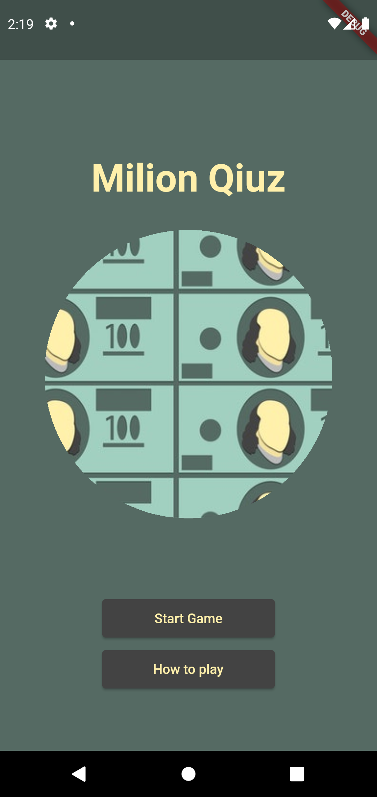
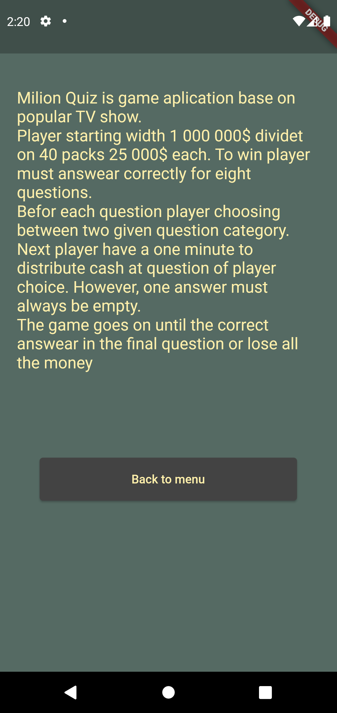
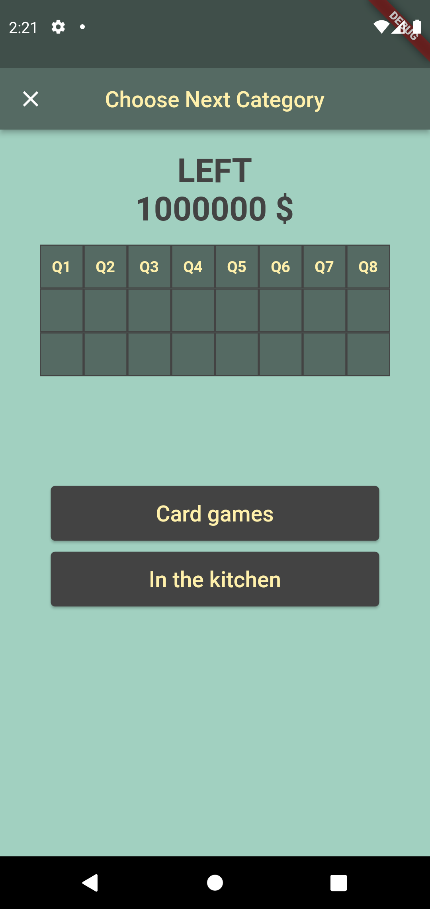
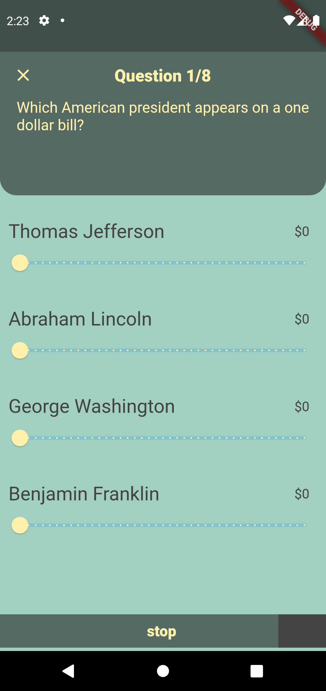
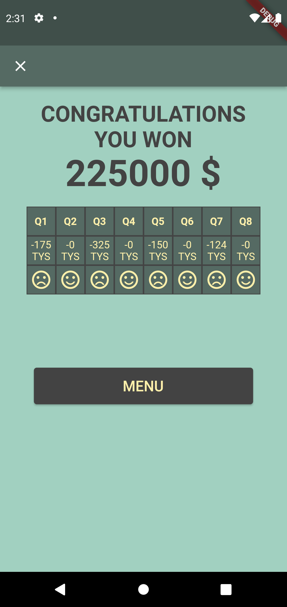
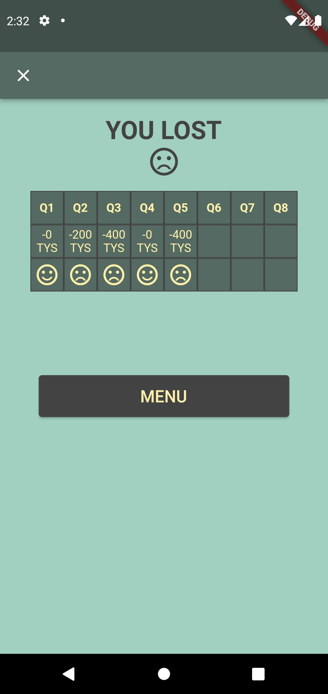

# Milion Quiz app
#### Video Demo:  <URL HERE>

## Introduction
__*Hello World*__, this is my very first project, created by final project on cs50 course. 
The idea for the project was born out of my interest in watching various types of quiz shows. Milion Quiz is game aplication base on popular TV show - __*"The Money Drop"*__.
#### The rules are simple:

Player starting width 1 000 000\$ dividet on 40 packs 25 000\$ each. To win player must answear correctly for eight questions.
Befor each question player choosing between two given question category. Next player have a one minute to distribute cash at question of player choice. However, one answer must always be empty.
The game goes on until the correct answear in the final question or lose all the money.

## Technologies used:
* __Flutter__
* __Dart__
* __Python__
* __SQLite__
* __Jupyter Notebook__

The application was developed in Flatter - an open source framework by Google for building, natively compiled, multi-platform applications from a single codebase. It was chosen because of its versatility, relative simplicity and native compilation on various platforms. Flutter is based on the Dart language, which also has many libraries, allowing universal use for many applications. The quiz questions are contained in a database created in SQLite, with the help of python to process the data. 

## Data
The questions are from the "OPEN TRIVIA DATABASE" available at the following link: https://opentdb.com/

The database includes questions of different types, with varying degrees of difficulty, which worked out perfectly for the needs of this project. 
Of course, the created database is only a demo version, in the future it is not excluded to use other APIs or create questions on their own. 

## Project implemenation overwiew
The project can be divided into two parts:
* Aplication - (the main part)
* Questions database

### Questions database
Created in Jupiter Notebook. Contains preprocessing of the data in order to process it properly and save it as a SQLite database. 

Questions are divided into 3 categories, according to the rules outlined earlier, importantly, subsequent categories generally contain questions of greater difficulty. A structure is created containing the question, the answers, the category and the correct answer. Then the prepared formats from Pandas Dataframes are saved to SQL tables in a .db file. 

### Aplication
#### Files:
__main__ -> Main application file. It also contains the implementation of global variables for the operation of the application. 

__helper__ and __data__ -> Includes classes and methods to help you work with the database - (loading, categorizing, converting to objects, drawing questions)

__welcome_screen__ -> This is the welcome screen. It is possible to go from it to the beginning of the game (questions for the whole game are then also drawn) or to check the rules of the game. 

__how_to_play_screen__ -> Screen with information about the rules of the game.

__category_screen__ -> The screen includes the ability to choose between two categories of future question. The course of the current game is also presented there. 

__questions_screen__ -> The most extensive file. Briefly contains the question and possible answers. The whole mechanics of dividing the money with sliders is implemented there. The conditions for correct division are checked and time is measured. After the answer is given, the correctness of the answer is checked.  

__loseScreen__ -> The screen that runs when a game is lost. Contains the course of the finished game and information about the loss. 

__winningScreen__ -> A screen launched when a game is won. Contains the course of the finished game and information about the win. 

## Aplication screens:

